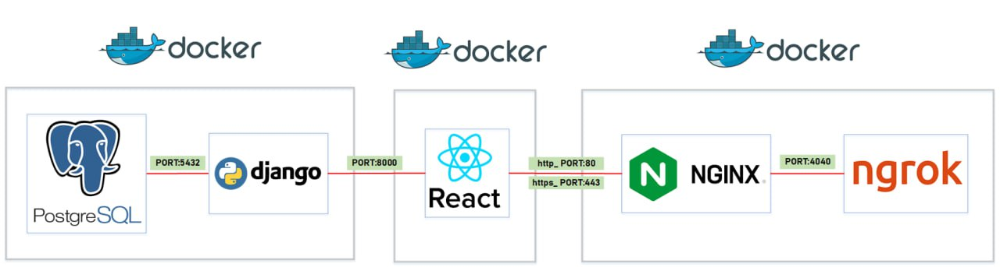

# [Hackathon_telehack](https://telehack.ru/services/)  
## Репозиторий команды <u>ХристOS</u>

## Тема:  
Разработка специального программного обеспечения конвертации результатов измерений радиоконтрольного оборудования тестирования (мониторинга) параметров услуг подвижной радиотелефонной связи.

## Участники команды:
1) <a href="https://github.com/S3raphimCS">Задонский Сергей</a> (<i>Капитан</i>) 
2) <a href="https://github.com/Merkucios">Медведев Андрей</a> 
3) <a href="https://github.com/QuiO-D">Лосев Никита</a> 
4) <a href="https://github.com/ruPaTRiK">Ликоренко Артем</a>  
5) <a href="https://github.com/AFKMDaniel">Малаховский Даниил</a>  
  

## Стек используемых технологий:  
- Python 
- Django (REST)  
- Typescript 
- Nextjs 
- React  
- PostgreSQL 
- Docker 

## Инфраструктура приложения:

## Инструкция по развертыванию 
Перед работой требуется создать сам .env файл и внести изменения для продукта:
>**Linux**: cp .env.tpl .env

>**Windows**: copy .env.tpl .env

Для запуска контейнеров требуется прописать в терминале команду, приведённую ниже, обязательно требуется находиться в корневом каталоге. В проекте существует две вариации работы с докером, это dev и prod версии. Приведём пример на dev версии.
> docker-compose -f docker-compose.dev.yml build\
> docker-compose -f docker-compose.dev.yml up

Для развёртывания приложения требуется передать в параметр -f docker-compose-prod.yml. Prod версия содержит в себе сервисы Certbot и Nginx.

Для выключения контейнеров:
> docker-compose -f docker-compose.dev.yml down

Каждый контейнер записывает логи в формате JSON-файла
> docker info --format '{{.LoggingDriver}}'\
Вывод: json-file

По каждому контейнеру можно просмотреть лог, пример:
> docker logs pgdb

Приложение автоматически работает на соответсвующих портах:
> **Django REST Framework** - Домен:8000\
**React application** -  Домен:3000\
**PostgreSQL** - КластерСУБД:5432

[В начало](#hackathontelehack-)